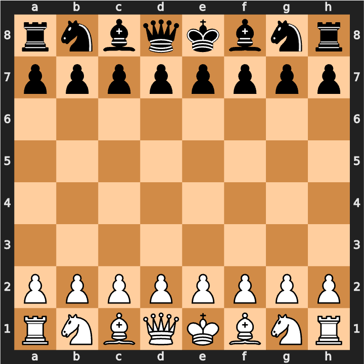

# Fishsticks Chess

*Building a chess bot using a convolutional neural network inspired by Stockfish*

Presenting my final project at the Spiced Academy Data Science bootcamp

`npm install` and then `npm start` to start front-end server and `npm start-api` to start api server

## The approach

Since convolutional neural networks are good at image recognition maybe that could be transferred to evaluating a chess board.

As images are grids with three dimensions (blue/red/green), the chess board could similarly translated as a grid in twelve dimensions (one for each colour's pieces).

## Training data

To train the model, data was gathered from Computer Chess Rating Lists (CCRL) which tests chess engines against each other. 10 million board positions were gathered from games played in the last months and translated to 12D bitboards

Pictured are 2 dimensions of the bitboard representing the white pawns and knights

## Position evaluation

Next was trying to decide how to evaluate the position. There are basic ways to evaluate the boards such counting pieces  but I decided to use Stockfish (a popular open source engine that can be run on a CPU). Stockfish can take a board as an input and output a score. The score was then normalised from 0-1 (0 being good for black and 1 being good for white)

## The model

A simple convolutional neural network was used with:
* An input layer for the bitboards
* One convolutional 2D layer with 128 filters and ReLU activation function
* A flatten layer
* A dense layer with 128 units and a ReLu activation function
* A final Dense layer with one unit and a Sigmoid function to output a score.

## The engine

A depth parameter can be given which specifies how many turns the engine will look ahead to try and find the best move. This gets exponentially large and takes a really long time above a certain depths.

The algorithm used is Minimax which helps determine what is the best move for the current player assuming the opposing player will optimise what's best for them at each turn. To try to reduce unnecessary calculations from the model alpha-beta pruning was also used when going through the tree of moves

## The app

The front-end is React (JavaScript)\
The back-end is Flask (Python)

